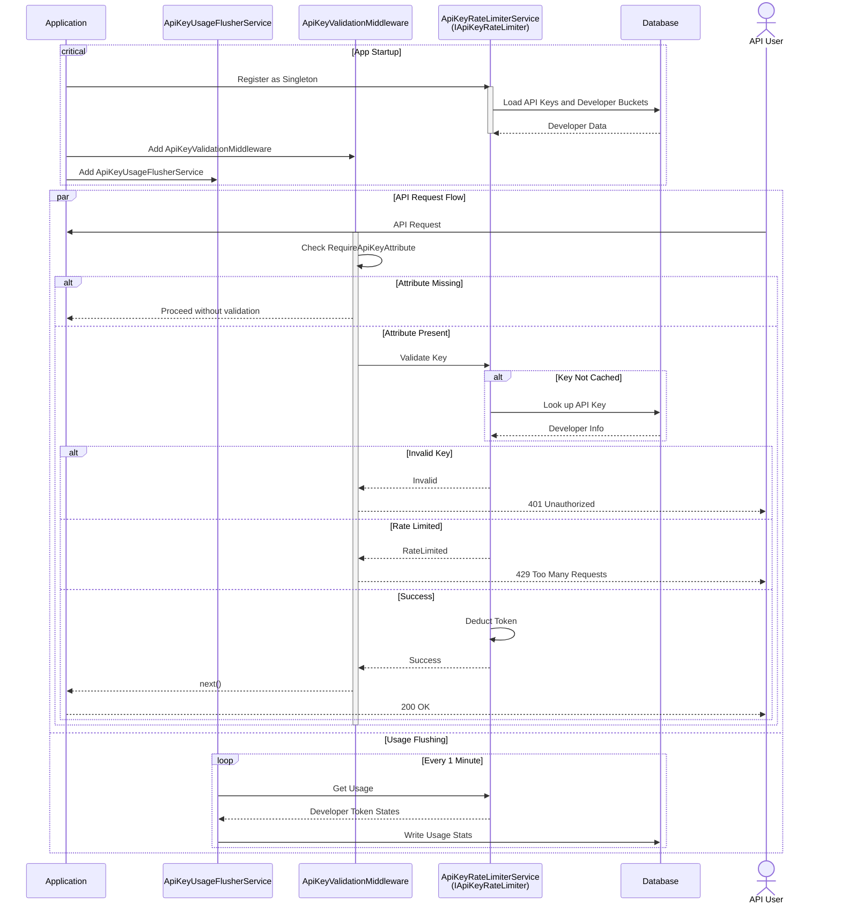

# MTD Developer API

This repository contains the source code for the MTD Developer API,
which provides access to both real-time and static data and services related the Champaign-Urbana Mass Transit District (MTD).
The API is designed to be used by developers to build applications that interact with MTD's data and services.
For example, it can be used to build real-time bus tracking applications, trip-planners, and other tools that help users navigate the MTD system.

## Program startup and configuration

The application is bootstrapped in [`Program.cs`](Mtd.PublicApi.Api/Program.cs). Key steps during startup are:

- **Configuration** – settings are loaded from `appsettings.json`, optional environment overrides and Azure Key Vault. Connection strings are bound to a strongly typed `ConnectionStrings` options object and validated at start up.
- **Logging** – [Serilog][serilog] is configured for structured logging and a bootstrap logger is used to capture failures during startup.
- **Data access** – Entity Framework Core connects to Azure SQL using the `AzureSqlAccessTokenInterceptor` so the API can authenticate with managed identities. Connection resiliency and query splitting are enabled.
- **Dependency injection** – repositories, cache managers, the API key rate limiter and hosted background services are registered with the built in DI container.

### Middleware pipeline

`Program.cs` builds the HTTP pipeline with a number of `app.Use*` calls. The order is significant because each component can short‑circuit further processing.

1. **`UseSerilogRequestLogging`** – logs every request and sets the log level based on the response status code.
2. **`UseHsts`** *(production only)* – adds the [HTTP Strict Transport Security][hsts] header so browsers always use HTTPS.
3. **`UseHttpsRedirection`** – redirects HTTP requests to HTTPS before routing occurs.
4. **`ApiExceptionHandlingMiddleware`** – catches unhandled exceptions and converts them to a `500` response using the standard envelope.
5. **`MapOpenApi().CacheOutput()`** – exposes the generated OpenAPI document at `/openapi/v1.json` and caches it.
6. **`UseRouting`** – enables endpoint routing and must run before anything that relies on route data.
7. **`ApiKeyValidationMiddleware`** – validates API keys on endpoints decorated with `[RequireApiKey]` and enforces rate limits.
8. **`UseCors`** – applies the configured CORS policy so the API can be called from browsers.
9. **`UseOutputCache`** – serves cached responses when available, short‑circuiting the rest of the pipeline.
10. **`UseDefaultFiles`** and **`UseStaticFiles`** – serve the Swagger UI and any other static files from `wwwroot`.
11. **`MapControllers`** – matches attribute‑routed controllers. This is a terminal middleware; nothing after this runs if a controller handles the request.
12. **`StatusCodeResponseMiddleware`** – ensures that unhandled status codes (404, 401, etc.) still return the standard API envelope.
13. **`MapHealthChecks("/healthz")`** – exposes a health endpoint for probes and monitoring systems.

## Consistent response envelope and custom errors

All controller actions return an [`ApiResponse<T, TError>`](Mtd.PublicApi.Api/Models/ApiResponse.cs) object.
Successful requests populate the `Result` property while failures populate `Error` with an [`ApiError<T>`](Mtd.PublicApi.Api/Models/ApiError.cs) that includes a machine readable code and a human friendly message.
Common codes are defined in [`ApiResponseCodes`](Mtd.PublicApi.Api/Models/ApiResponseCodes.cs).

The `StatusCodeResponseMiddleware` and `ApiExceptionHandlingMiddleware` make sure every response follows this pattern even when an error originates outside of controller code.

## API Key Validation and Rate Limiting

This section describes how API key validation and rate limiting is implemented.

### Overview

API key validation ensures that only authenticated and authorized developers can access certain endpoints in the API.
Endpoints must be explicitly marked with a `[RequireApiKey]` attribute to require validation.

Rate limiting is applied per developer using a shared [token bucket algorithm][token-bucket].
Each developer may have multiple API keys, but their rate limit is enforced at the developer level.


### Middleware and Attribute Flow

#### `RequireApiKeyAttribute`

- A custom attribute used to mark controllers or actions that require API key validation.
- If this attribute is missing from the current endpoint, validation is skipped.
- This attribute should be set on all API controllers or methods that require API key validation (most or all of them).

```csharp
[AttributeUsage(AttributeTargets.Class | AttributeTargets.Method)]
public sealed class RequireApiKeyAttribute : Attribute {}
```

#### `ApiKeyValidationMiddleware`

- This middleware intercepts incoming HTTP requests and checks if they require API key validation.
- Checks if the current request targets an endpoint decorated with `[RequireApiKey]`.
- If so, attempts to extract the `X-ApiKey` header.
- Delegates the actual validation to `IApiKeyRateLimiter`.
- Based on the result, either passes the request to the next middleware or writes an error response.

#### Rate limit headers

When a developer exceeds their quota, the middleware returns a `429 Too Many Requests` response. The API uses the
IETF `RateLimit-*` response headers and a `Retry-After` header to convey the current limits:

- `RateLimit-Limit`: Maximum number of requests allowed per hour.
- `RateLimit-Remaining`: Requests left in the current window.
- `RateLimit-Reset`: Seconds until the limit resets.

### Validation Service

#### `IApiKeyRateLimiter`

- Interface abstraction for validating API keys and applying rate limits.

#### `ApiKeyRateLimiterService`

- this will be registered as a singleton in the DI container.
- Implements `IApiKeyRateLimiter`.
- Uses two in-memory maps:
  - `apiKey → developerId`
  - `developerId → DeveloperRateLimitBucket`
- Periodically persists usage data via a background service.
- Attempts to refresh from database if API key not found in memory.
- This allows API key lookup to be very fast for most requests while still persisting data to a database for durability.

##### `TryValidateKeyAsync(string apiKey, HttpContext context)`

- Looks up the developer ID using the API key.
- If missing, attempts to retrieve it from the database.
- Applies token bucket rate limiting for the developer.
- Stores developer ID in `HttpContext.Items["DeveloperId"]` for downstream access by controllers.
- Controllers can retrieve it via `HttpContext.Items["DeveloperId"]`.
- Returns an enum `ApiKeyValidationResult`:
  - `Success`
  - `Invalid`
  - `RateLimited`
  - `InternalError`


### Developer Token Bucket

#### `DeveloperRateLimitBucket`

- Implements the [token bucket algorithm][token-bucket] to track request capacity.
- Fields:
  - `Capacity`: Max tokens per hour
  - `Tokens`: Current available tokens
  - `LastRefillTime`: Last time tokens were replenished
- Methods:
  - `TryConsumeToken()`: Checks if a token is available, consumes one if so.
  - Tokens refill linearly over time based on last usage.

### Token Bucket Algorithm Explained

#### Concept

The token bucket algorithm is a rate-limiting technique that allows for bursts of traffic while maintaining an average rate.

#### Mechanism

1. A bucket holds a fixed number of tokens.
2. Each request consumes one token.
3. Tokens are replenished at a fixed rate over time.
4. If the bucket is empty, requests are rejected (rate-limited).
5. If the bucket is full, excess tokens are discarded (bucket overflows).

#### Benefits

- Allows short bursts without penalty.
- Enforces fair usage over time.
- Easy to implement and reason about.

### Example Flow



[serilog]: https://serilog.net/
[token-bucket]: https://en.wikipedia.org/wiki/Token_bucket
[hsts]: https://developer.mozilla.org/en-US/docs/Web/HTTP/Headers/Strict-Transport-Security
