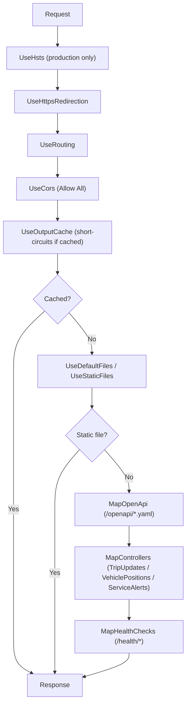

# MTD GTFS-Realtime API

[](https://github.com/CUMTD/Mtd.GtfsRealTime/actions/workflows/build.yml)

A lightweight ASP.NET Core 10 API that exposes [GTFS-Realtime](https://gtfs.org/realtime/) feed endpoints for the **Champaign-Urbana Mass Transit District (MTD)**:

| Endpoint | Source |
|---|---|
| `GET /trip-updates/` | Proxied from a configured upstream feed server |
| `GET /vehicle-positions/` | Proxied from a configured upstream feed server |
| `GET /service-alerts/` | Built from active reroutes in the Stopwatch database |

Responses default to `application/protobuf` binary. JSON is available (opt-in via config) using canonical proto3 JSON via `Google.Protobuf.JsonFormatter`.

---

## Solution layout

| Project | Role |
|---|---|
| `Mtd.GtfsRealTime.Protos` | Shared `.proto` source files, distributed as a NuGet package |
| `Mtd.GtfsRealTime.Codegen` | Compiles the proto files into C# classes via `Grpc.Tools` |
| `Mtd.GtfsRealTime.Proto.Helpers` | Conversion helpers: reroutes → `FeedMessage`, HTML stripping, enum mapping |
| `Mtd.GtfsRealTime.Api` | ASP.NET Core web API — controllers, formatter, health checks, Swagger UI |

---

## Getting started

### Prerequisites

- [.NET 10 SDK](https://dotnet.microsoft.com/download)
- [Azure CLI](https://learn.microsoft.com/cli/azure/install-azure-cli) — for local credential authentication
- Access to the MTD Azure subscription (to read secrets from Key Vault)
- [Node.js](https://nodejs.org/) — `npm ci` runs during build to install Swagger UI assets

### 1. Authenticate with Azure

The app uses `DefaultAzureCredential` to authenticate to Azure SQL and Azure Key Vault. For local development, authenticate with the Azure CLI:

```bash
az login
```

### 2. Set the Key Vault URL in user secrets

The only secret that must be present locally is the Key Vault URL. All other configuration is loaded from Key Vault at startup.

```bash
cd Mtd.GtfsRealTime.Api
dotnet user-secrets set "KeyVaultUrl" "https://<your-keyvault-name>.vault.azure.net/"
```

> **Note:** The Key Vault must contain the following secrets:
> - `ConnectionStrings--StopwatchConnectionString`
> - `GtfsRealTime--TripUpdateFeedUrl`
> - `GtfsRealTime--VehiclePositionFeedUrl`
> - `Health--TripUpdatesCheckUrl`
> - `Health--VehiclePositionsCheckUrl`
> - `Serilog--WriteTo--0--Args--ServerUrl` (Seq)
> - `Serilog--WriteTo--0--Args--ApiKey` (Seq)

### 3. Run the app

```bash
cd Mtd.GtfsRealTime.Api
dotnet run
```

`appsettings.Development.json` sets `"AllowJson": true`, which enables the `application/json` content-type option and is useful for exploring responses in a browser or Swagger UI.

### 4. Open Swagger UI

Navigate to `https://localhost:<port>/swagger/` (or the port shown in your terminal). The UI defaults to `application/protobuf` — use the content-type dropdown to switch to JSON.

---

## Configuration reference

All configuration keys are resolved in order: `appsettings.json` → `appsettings.{Environment}.json` → environment variables → Azure Key Vault.

| Key | Required | Description |
|---|---|---|
| `KeyVaultUrl` | Yes | Azure Key Vault URI. Must be in user secrets or an environment variable — not in `appsettings.json`. |
| `ConnectionStrings:StopwatchConnectionString` | Yes | Azure SQL connection string for the Stopwatch database (no password needed — managed identity auth). |
| `GtfsRealTime:TripUpdateFeedUrl` | Yes | Upstream GTFS-RT Trip Updates feed URL. |
| `GtfsRealTime:VehiclePositionFeedUrl` | Yes | Upstream GTFS-RT Vehicle Positions feed URL. |
| `Health:TripUpdatesCheckUrl` | Yes | URL for the downstream health check HEAD request (trip updates). |
| `Health:VehiclePositionsCheckUrl` | Yes | URL for the downstream health check HEAD request (vehicle positions). |
| `AllowJson` | No | `true` enables `application/json` responses. Default `false` (production). Set to `true` in `appsettings.Development.json`. |
| `Cors:PolicyName` | Yes | Name of the CORS policy (unrestricted public access). |
| `Serilog` | Yes | Serilog configuration block (sinks, levels). Seq credentials come from Key Vault. |

---

## Response formats

The API returns protobuf binary by default. When `AllowJson` is `true`, clients may request JSON by sending `Accept: application/json`.

| `Accept` header | Response `Content-Type` | Body |
|---|---|---|
| `application/protobuf` (or none) | `application/protobuf` | Binary protobuf |
| `application/x-protobuf` | `application/x-protobuf` | Binary protobuf |
| `application/json` | `application/json` | Canonical proto3 JSON |

Protobuf responses include `Content-Disposition: attachment` so that Swagger UI shows a download link.

---

## Middleware pipeline



---

## Output caching

| Policy | Used by | Duration |
|---|---|---|
| `RealTimeDataCache` | Trip Updates, Vehicle Positions | 5 seconds |
| `StaticDataCache` | Service Alerts | 5 minutes |

Both policies vary by `Accept` header, query string, and route values so protobuf and JSON responses are cached separately.

---

## Health checks

| Endpoint | Tags checked | What it tests |
|---|---|---|
| `GET /health/live` | `live` | API process is running |
| `GET /health/ready` | `ready` | DB reachable + downstream feeds reachable |
| `GET /health/healthy` | `healthy` | All checks (self + DB + downstream) |
| `GET /health/db` | `db` | Azure SQL connectivity via EF Core |
| `GET /health/network` | `network` | Downstream feed servers respond with `200` to HEAD |

All health endpoints return JSON.

---

## Deployment

The app is deployed to **Azure App Service (Linux)** using a **system-assigned managed identity**.

- Authentication to Azure SQL and Azure Key Vault uses `DefaultAzureCredential` — no passwords or connection-string secrets needed in the app configuration.
- The `KeyVaultUrl` app setting must be configured in the App Service application settings.
- Set `AllowJson=false` (or omit it) in production to disable JSON output.
- HSTS is enabled in production (`Preload`, `IncludeSubDomains`, 2-year `max-age`).
- Structured logs are shipped to Seq (credentials from Key Vault) and to the console.
